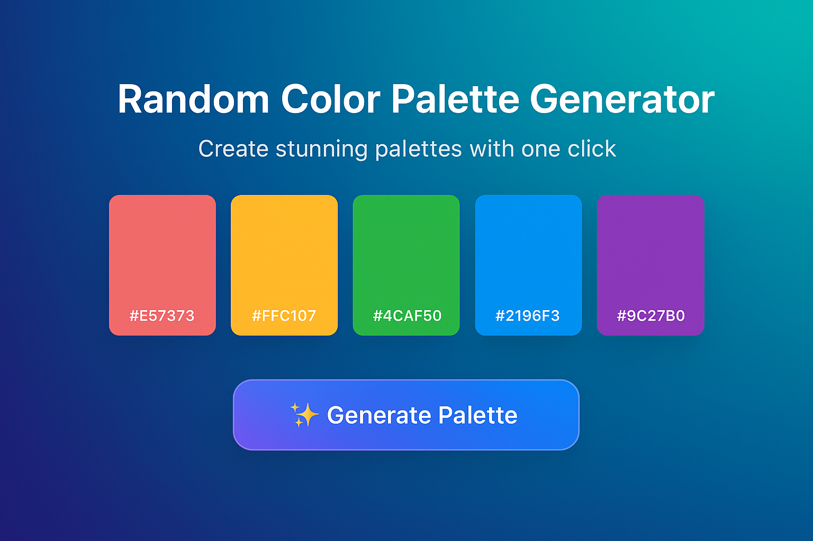

# I See Colors 🔴🟠🟡🟢🔵🟣

A sleek and modern **Color Palette Generator** that creates 5 beautiful random colors every time you click the button.  
Perfect for designers, developers, and creatives looking for instant color inspiration.  

🌐 **Live Demo:** [https://fabian1ouis.github.io/i-see-colors](https://fabian1ouis.github.io/i-see-colors)

---

## ✨ Features
- 🔴🟡🟢🟣 Generates fresh palettes on each click  
- 📋 Click on a color to copy its hex code  
- 💾 Saves your last palette automatically  
- 💫 Animated floating color cards & glassmorphic UI  
- 🎨 Built with simplicity and creativity in mind  

---

### 🖼️ Screenshot

## 🧰 Tech Stack
- **HTML5**
- **CSS3 (Glassmorphism + Animations)**
- **Vanilla JavaScript**

---

> 💬 “Colors speak louder than words.” — Let your creativity shine!

---

👨‍💻 Built with ❤️ by [@fabian1ouis](https://github.com/fabian1ouis)
